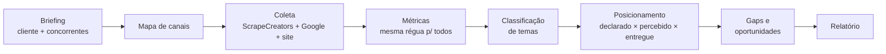

# Análise de Concorrentes — Discovery 2SAY

Skill do [Claude Code](https://claude.com/claude-code) que faz a etapa 4 do Discovery
(Análise de Concorrentes) de ponta a ponta: briefing do cliente e dos concorrentes, coleta
de métricas públicas de Instagram, Facebook, LinkedIn, YouTube, TikTok, anúncios da Meta,
avaliações do Google e desempenho do site, comparação na mesma régua, e diagnóstico de
posicionamento com gaps e oportunidades — tudo no formato que já é usado no Discovery.

Antes dela, essa etapa era só qualitativa (leitura de bio, site e feed, sem número). Agora
a brecha que o diagnóstico aponta vem com evidência.

## Como funciona



Cada etapa é um comando de um script Python (sem instalar pacote nenhum) que o Claude roda
sozinho durante a conversa — você só participa do briefing, da classificação de temas (o
Claude propõe, você confirma) e da leitura final.

## Instalação rápida

1. Copie a pasta deste repositório para dentro de `.claude/skills/` do seu projeto ou
   vault (pode ser qualquer pasta local sua — não precisa ser um vault específico).
2. Abra o Claude Code nessa pasta. A skill aparece sozinha, sem mais nada pra instalar.
3. Crie uma conta grátis em [scrapecreators.com](https://scrapecreators.com) (100 créditos
   de graça) e peça pro Claude gravar a chave — dentro da própria conversa:
   > cola a chave da ScrapeCreators: `<sua chave>`, grava ela pra mim

   ou direto no terminal:
   ```
   python3 .claude/skills/analise-concorrentes-discovery/scripts/configurar.py --set SCRAPECREATORS_API_KEY=<sua chave>
   ```
4. Confira se está tudo certo: peça *"roda a checagem da skill de análise de
   concorrentes"*.

Passo a passo completo, com prints do que esperar e solução de problemas comuns, em
[`INSTALACAO.md`](INSTALACAO.md).

## Como usar

Depois de instalada, é só pedir em linguagem natural, dentro do Claude Code:

> "faz a análise de concorrentes do Discovery do cliente X, concorrentes: A, B e C"

O Claude conduz o briefing (só pergunta o que faltar), mostra quanto vai custar em créditos
antes de coletar, e entrega o relatório na pasta de trabalho do cliente.

## Custo

A skill roda em cima da API da [ScrapeCreators](https://scrapecreators.com) (pay-as-you-go,
sem assinatura obrigatória) e, opcionalmente, da PageSpeed Insights do Google (grátis). Uma
análise típica — 1 cliente + 3 concorrentes, 6 canais — gasta cerca de **60 créditos**. O
pacote de US$ 47 traz 25 mil créditos, que não expiram: dá para rodar dezenas de análises
por poucos centavos cada. Detalhe de custo por endpoint em
[`references/fontes-e-custos.md`](references/fontes-e-custos.md).

## O que tem (e o que não tem) neste repositório

- **Tem:** os scripts, o roteiro completo da skill, os padrões de leitura e armadilhas já
  identificadas, e o modelo de relatório — tudo genérico, reutilizável em qualquer cliente.
- **Não tem:** exemplos de relatório com dado real de cliente. O primeiro caso completo foi
  uma associação empresarial regional; quem tem acesso ao vault interno da 2SAY encontra o
  relatório de verdade lá, fora deste repositório.
- Algumas frases do roteiro citam documentos que só existem no vault interno da 2SAY (a
  metodologia do Discovery, o guia de escrita anti-IA). Isso não afeta o funcionamento —
  é só contexto extra para quem já trabalha dentro daquele vault.

## Estrutura

```
.
├── SKILL.md                        # o roteiro que o Claude segue (o "código" da skill)
├── INSTALACAO.md                   # passo a passo de instalação para quem não é técnico
├── references/
│   ├── briefing.md                 # modelo de briefing (cliente + concorrentes)
│   ├── metricas-e-leitura.md       # definições, armadilhas e padrões de leitura
│   ├── relatorio-modelo.md         # estrutura do relatório final
│   └── fontes-e-custos.md          # endpoints usados, custo por chamada, limites
├── scripts/
│   ├── sc.py                       # cliente da API + onde fica o .env de cada instalação
│   ├── configurar.py               # cria/atualiza o .env sem editar arquivo oculto na mão
│   ├── checar.py                   # confere se a instalação está pronta pra rodar
│   ├── coletar.py                  # puxa e normaliza os dados públicos
│   ├── sites.py                    # tecnologia, CTA, frescor e desempenho do site
│   └── metricas.py                 # monta as tabelas comparativas e o painel de temas
└── evals/evals.json                # casos de teste da skill
```

## Manutenção

Feita e mantida pelo time de marketing/growth da 2SAY. Encontrou um endpoint quebrado, uma
leitura que não bateu, ou quer adaptar as categorias de tema pra um segmento novo? Abre uma
issue ou já manda o ajuste — os scripts são Python puro, sem build, sem dependência externa
além da biblioteca padrão.

## Licença de uso

Uso interno do Grupo Coonecta / 2SAY. Não é software de código aberto.
